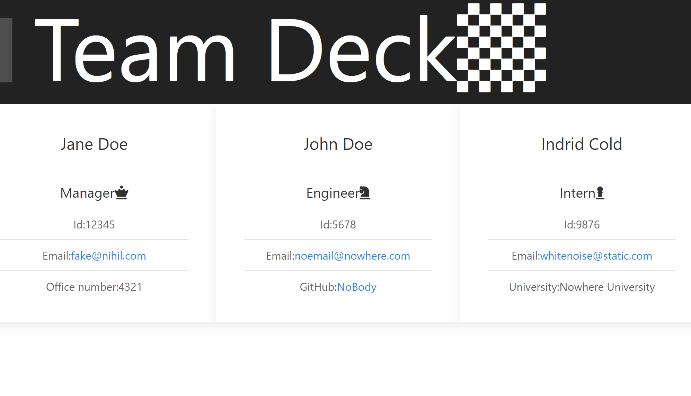

  # Team Deck Generator 
  
  This application will generate a card directory of team members via comand line prompts.
  

  ## Table of Contents
  * [Installation](#installation)
  * [Usage](#usage)
  * [License](#license)
  * [Contributing](#Contributing)
  * [Tests](#Tests)
  * [Questions](#Questions)
  
  ## Installation
  Prior to use one must install dependant packages (inqirer)
  
       
       npm install

       
    
  ## Usage
  to use run file in node
  
       
       node index

       
    
  ## License
  No License
  ## Contributing
  If one desires to contribute, open an issue or contact email below.
  ## Tests
  To test one must first have Jest installed, then in comand line  
  
      npm run test
  ## Questions   
  [Email](mailto:emailcodydiab@gmail.com)

  [GitHub](https://github.com/CodyDiab)

  ## Link to Video of App.

  [Link](https://drive.google.com/file/d/1ps5y2uH1SG_RckTnGzkpxFC4zDPxB1N6/view)
